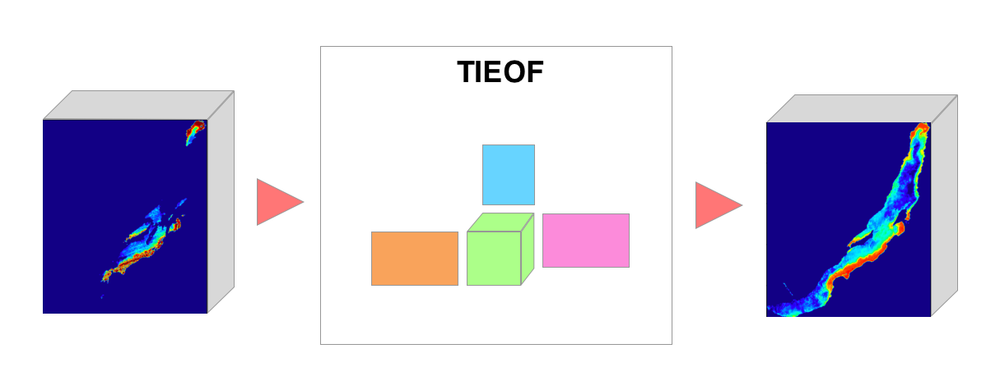

# TIEOF: Algorithm for recovery of missing multidimensional satellite data on water bodies based on higher-order tensor decompositions

## Status

Published in [MDPI Water](https://www.mdpi.com/journal/water)

[paper](https://www.mdpi.com/2073-4441/13/18/2578) 

## Description

TIEOF (Tensor Interpolation using Empirical Orthogonal Functions) is an algorithm for the recovery of unknown values within multidimensional tensors based on relationships observed within known values. It stems from the renowned [DINEOF](http://modb.oce.ulg.ac.be/mediawiki/index.php/DINEOF) (Data INterpolation using Empirical Orthogonal Functions) algorithm and introduces more sophisticated EOF extraction engine based on higher-order tensor decompositions: HOSVD, HOOI and PARAFAC. For now only three-way tensors are supported.




## Installation

0. *(Optional)* Install GHER DINEOF: http://modb.oce.ulg.ac.be/mediawiki/index.php/DINEOF. *Needed only if you want to use the original GHER DINEOF. The installed shell command should be inserted into `script/config/main_dineof_gher_default.yml: dineof_executer` field. DINEOF is intended to be called through `script/main.py` utility.*

1. Install dependencies  
```bash
pip install -r requirements.txt  # Python 3 is required
```

**Tested on Ubuntu 20.04.**

## Usage

This package supports two types of usage: through the python module and through the shell scripts. All of the shell scripts are located inside `script` folder. You may use `--help` flag to get the detailed usage instructions. The python module typical usage is described below.

0. *(Optional)* Prepare the data. You may use `interpolator` to interpolate raw satellite data into the static grid. Additional script `script/interpolate.py` is implemented for convenient usage in the terminal.

Interpolator is able to work with `.nc` files. It is mainly adopted to the [NASA OceanColor format](https://oceancolor.gsfc.nasa.gov/), which is:

* File names are in the format - **\*[A-Z]\*YYYYDDD.\*.nc**
* Groups inside:
    * **navigation_data**  

            With variables:  

                1. longitude  
                2. latitude

    * **geophysical_data**  

            With variables:  

                1. investigated object (e.g. chlor_a).

1. Run the module in your python 3.* scripts  
```python
# Example
from model import DINEOF3


# Some 3D numpy tensor with shape [number of points, 3], 
# where 2nd dimension is coordinates (e.g. latitude, longitude, day)
X_train = ...
# 1D numpy array with values of some investigated object. Has shape: [number of points].
y_train = ...

# Some test data
X_test = ...
y_test = ...

# DINEOF3 models inherits from the sklearn BaseEstimator, 
# so you may use it inside Grid Search routines etc.
d = DINEOF3(...)

d.fit(X, y)

y_pred = d.predict(X_test)  # Get predictions
score = d.score(X_test, y_test)  # Calculate score

```
